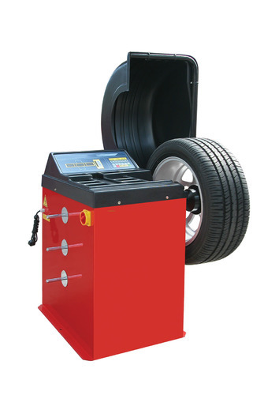
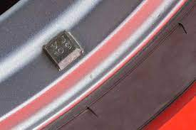
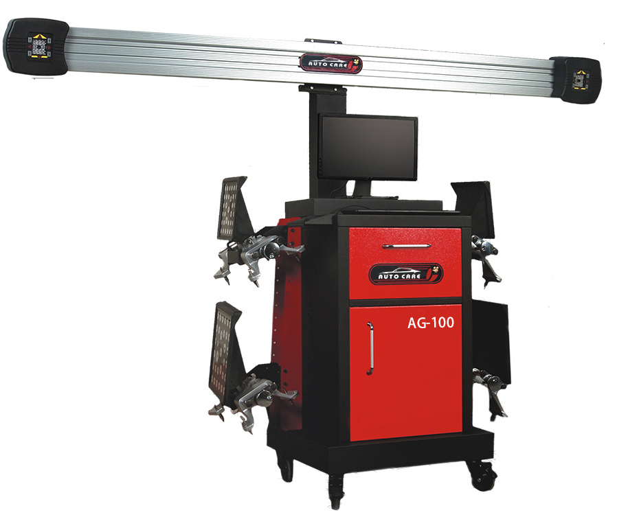

# Wheel balancing and alignment

Wheel alignment costed Rs.300 and Wheel balancing costs Rs.150 per tyre. Jan 2022

Wheel balancing for alloy wheels is done by pasting aluminium sticker weights whereas for normal wheels, a metal hook is inserted which costs way more cheaper than aluminium weights.

The wheel will be mounted to a wheel balancing machine which automatically finds the weight distribution and indicates the place where the weights needs to be applied. It also shows how much weights needs to be added.&#x20;

In my case, all the types needed weight adjustment of 15-20 grams except for a wheel which showed 50 grams. That tire had worn out and needed a lot of weights for adjustment but the technician added just 15 grams and when asked, he said for alloy wheels its not recommended to but such heavy weights and its better to get the balancing done after purchasing new tyre. This is probably a trick for them to save money on weights.


Weights for metal wheels&#x20;


 

