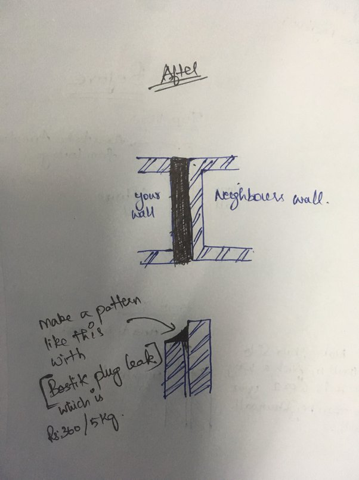

# Waterproofing adjacent walls

&#x20;If a wall shares an adjacent wall from another building, the gap tends to expand or contract. To fix this issue, we need to have a small slope like structure between the two walls. One wall should be trimmed down by 2-4 inches and then apply concrete coping or any other sealing agents.

