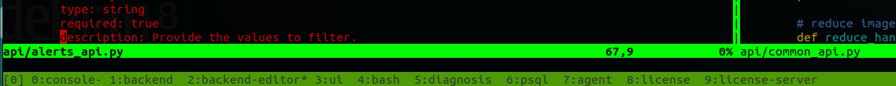

# Tmux

## Tmux scripting

Tmux is one of best productivity tools for remote sessions on cloud virtual machines.

If one has setup a complex tmux window configuration \(see below\) and we need to get it up quickly after a reboot, tmux allows scripting.



In the above screenshot, we see 10 tmux windows for different directories. Some of the windows are used for editing, while some might have log monitoring or it could an active session to a database server.

This would take sometime to setup on a newly booted machine as tmux session are not persisted over reboots.

### The Script

```text
cd ~/workspace/projects/client
tmux new -s client -d
tmux new-window -t client -n 'console' 'cd ~/workspace/projects/client/console'
tmux new-window -t client -n 'backend' 'cd ~/workspace/projects/client/backend'
tmux new-window -t client -n 'backend-editor' 'vim -S ~/workspace/scripts/vim_sessions/backend.vim'
tmux new-window -t client -n 'ui'
.
.
.
tmux attach -t client

```

### Tmux resurrect plugin

Tmux allows you to configure even the size of the windows and panes. If thats too much to code yourself, tmux-resurrect plugin does all that with just simple commands

```text
prefix + Ctrl-s - save
prefix + Ctrl-r - restore
```

#### Description as on [https://github.com/tmux-plugins/tmux-resurrect](https://github.com/tmux-plugins/tmux-resurrect)

This plugin goes to great lengths to save and restore all the details from your `tmux` environment. Here's what's been taken care of:

* all sessions, windows, panes and their order
* current working directory for each pane
* **exact pane layouts** within windows \(even when zoomed\)
* active and alternative session
* active and alternative window for each session
* windows with focus
* active pane for each window
* "grouped sessions" \(useful feature when using tmux with multiple monitors\)
* programs running within a pane! More details in the [restoring programs doc](https://github.com/tmux-plugins/tmux-resurrect/blob/master/docs/restoring_programs.md).

Optional:

* [restoring vim and neovim sessions](https://github.com/tmux-plugins/tmux-resurrect/blob/master/docs/restoring_vim_and_neovim_sessions.md)
* [restoring pane contents](https://github.com/tmux-plugins/tmux-resurrect/blob/master/docs/restoring_pane_contents.md)

#### A sample Tmux resurrect saved session

```text
pane  0 0 :console  1 :*  0 :/home/kirthi/workspace/client_console  1 bash  : 
pane  0 0 :console  1 :*  1 :/home/kirthi 0 watch :watch uptime
pane  0 0 :console  1 :*  2 :/home/kirthi/.workspace/client_console/clair 0 watch :watch -n10 df -h
pane  0 0 :console  1 :*  3 :/home/kirthi 0 top :top
pane  0 1 :backend  0 :-  0 :/home/kirthi/.workspace/client_console/tests/core  0 bash  : 
pane  0 1 :backend  0 :-  1 :/home/kirthi/workspace/client_console/client_backend 1 bash  :
pane  0 2 :backend-editor 0 : 0 :/home/kirthi/workspace/client_console/client_backend/dockerify/cve_scan_registry/scan_registry 1 bash  :
pane  0 2 :backend-editor 0 : 1 :/home/kirthi/.workspace/client_console/tests/core  0 vim :vim conftest.py test_cve.py
pane  0 3 :psql 0 : 0 :/home/kirthi 1 docker  :docker exec -it client-postgres bash -c psql -U postgres
pane  0 4 :agent  0 : 0 :/home/kirthi/.workspace/client_agent 0 bash  :
pane  0 4 :agent  0 : 1 :/dev 1 watch :watch uptime
pane  0 5 :scope-editor 0 : 0 :/home/kirthi/.workspace/client_agent/tools/apache/scope  1 vim :vim . 
pane  0 6 :gopath 0 : 0 :/home/kirthi/.go 1 bash  :
pane  0 7 :df-go-lib  0 : 0 :/home/kirthi/.workspace/client_agent/misc/client 1 vim :vim df-utils/utils.go
pane  0 8 :bash 0 : 0 :/home/kirthi/workspace/client_console/client_diagnosis 1 bash  :
pane  0 9 :ui 0 : 0 :/home/kirthi/workspace/client_console/client_ui/client 1 bash  :
pane  0 10  :agent-tools  0 : 0 :/home/kirthi/.workspace/client_agent/tools/apache  1 vim :vim deepaudit/.
pane  1 0 :backend  1 :*  0 :/home/kirthi/.workspace/build_dir/client_agent 1 bash  :
pane  1 0 :backend  1 :*  1 :/home/kirthi 0 watch :watch df -h
pane  1 0 :backend  1 :*  2 :/home/kirthi 0 top :top
pane  1 1 :bash 0 :-  0 :/home/kirthi/.workspace/build_dir/client_console/client_ui\ (deleted)  1 bash  : 
window  0 0 1 :*  14e4,207x55,0,0[207x35,0,0,33,207x7,0,36,28,207x12,0,44{103x12,0,44,21,103x12,104,44,24}]
window  0 1 0 :-  d1a9,207x56,0,0[207x43,0,0,3,207x12,0,44,35]
window  0 2 0 : ae2b,207x56,0,0[207x38,0,0,5,207x17,0,39,34]
window  0 3 0 : c823,207x56,0,0,6
window  0 4 0 : ae2e,207x56,0,0[207x38,0,0,7,207x17,0,39,17]
window  0 5 0 : c826,207x56,0,0,9
window  0 6 0 : 643f,207x56,0,0,10
window  0 7 0 : 6440,207x56,0,0,11
window  0 8 0 : 6441,207x56,0,0,12
window  0 9 0 : 6442,207x56,0,0,13
window  0 10  0 : e43f,207x56,0,0,20
window  1 0 1 :*  b16a,207x56,0,0[207x42,0,0,29,207x13,0,43{103x13,0,43,30,103x13,104,43,31}]
window  1 1 0 :-  6442,207x56,0,0,32
state 0
```

